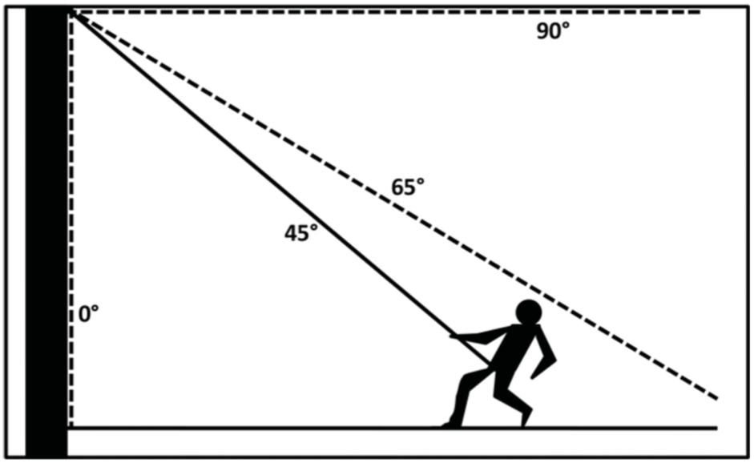
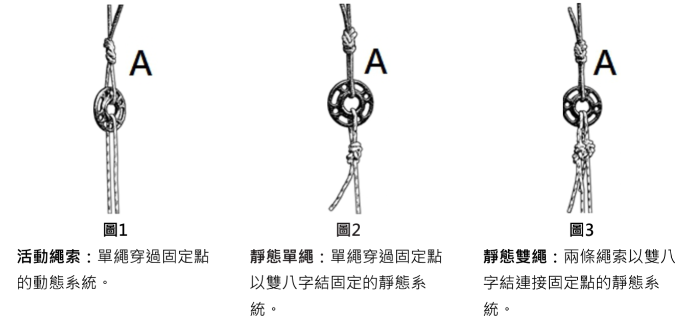

## 附錄1：雙繩腳鎖世界紀錄挑戰嘗試

雙繩腳鎖比賽若要改寫雙繩腳鎖的世界紀錄，必須滿足以下準則。

1. 在世界紀錄挑戰嘗試之前應通知ISA工作人員， ISA會確認屆時將由哪一位裁判出席。
2. 一名ITCC委員會（規則、執行、技術、ETCC/NATCC/APTCC)的現任委員作爲獨立裁判。
3. 分會或關連團體舉辦該挑戰項目必須安排一名適合的ITCC委員會委員出席，並支付所有相關費用。
4. 所有攀爬選手及工作人員使用的裝備必須符合現行ITCC規則及規定要求。
5. 必須遵循雙繩腳鎖比賽的規則。
6. 當使用電子計時器，應同時使用三個手動計時碼表，以便在電子計時器故障的情形下作為備用計時器。如果電子計時器出現故障，三個碼表計時的平均値將作爲完成時間。三個手動計時碼表的記錄時間，最快與最慢計時的差異必須不超過50/100秒以上才適合作爲記錄。如果計時的差異都超過此範圍以外，不列入官方紀錄，無法刷新世界紀錄。
7. 當使用手動計時，必須使用五個碼錶計時，最快和最慢的時間將被剔除，剩下的三個時間的平均值會被作為正式的完成時間。三個手動計時碼錶所記錄的時間，最快和最慢時間的差異不得超過50/100秒以上才記錄。如果計時的差異都超過此範圍以外，不列入官方紀錄，無法刷新世界紀錄。
8. 塡妥申請確認表格並送回ISA總部之ITCC聯絡員，經ITCC委員會主席簽署後，該時間才能被確認爲正式世界紀錄。
9. 照片和影像應用於驗證攀爬前後的高度量測值。

## 附錄2：雙繩腳鎖雙人對決摘要說明

雙繩腳鎖雙人對決是一個獨立項目，可以在任何ISA主辦的比賽中舉行。

- 雙繩腳鎖考驗參賽者在一條雙繩上，利用普魯士結(Prusik hitch)或其他認可的摩擦結(friction hitch)作防墜保護，以腳鎖(footlock)的攀爬方法在雙繩上垂直攀升至樹上的能力。男子及女子比賽的高度爲15公尺（49 英尺2.5英寸）。在分會的比賽，如果高度受到限制，男子及女子比賽的高度可以為12公尺（39英尺4.5英寸）。不得使用任何機械式上升器。此項目爲計時比賽，最快完成的參賽選手獲勝。
- 在雙繩腳鎖雙人對決比賽中，兩名參賽者在同一時間使用各自獨立的攀爬與計時系統來進行比賽。
- 所有參賽者及工作人員使用的裝備必須符合現行ITCC規則及規定要求。
- 當使用電子計時器，應同時使用三個手動計時碼錶，以便在電子計時器故障的情形下作為備用計時器。如果電子計時器出現故障，以三個碼錶計時的平均値作爲完成時間，且最快與最慢計時的差異必須不超過50/100秒以上才作爲記錄。如果計時的差異都超過此範圍以外，將不會產生任何時間紀錄。
- 當使用手動計時，必須使用五個碼錶計時，最快和最慢的時間將被剔除，剩下的三個時間的平均值會被作為正式的完成時間。三個手動計時碼錶所記錄的時間，最快和最慢時間的差異不得超過50/100秒以上才記錄。如果計時的差異都超過此範圍以外，將不會產生任何時間紀錄。
- **如果符合[附錄1：雙繩腳鎖世界紀錄挑戰嘗試](#附錄1：雙繩腳鎖世界紀錄挑戰嘗試)的所有要求，該時間將被紀錄爲世界紀錄。**

## 附錄3：空中拯救情境範例

比賽委員會必須對該比賽項目撰寫一份空中拯救情境。該份情境在比賽前必須保密並且在比賽開始前的會議中向所有參賽選手槪述。

以下是可以作為空中拯救情境的範例：

```
範例#1
天氣情況： 35°C (95°F)睛朗且濕度高。
現場情況： 你發現攀爬者在樹上不動。
攀爬者情況： 攀爬者有意識，呼吸困難及臉色泛紅，並且在溝通上有困難。
```
```
範例#2
天氣情況： 15°C(59°F) 多雲及潮濕。
現場情況： 一名攀爬者在樹上移動時滑倒跌落，她因為劇烈的擺盪而撞到樹的主幹。
攀爬者情況： 攀爬者有意識，但緊握其左手臂。她感到疼痛而且無法從自行從樹上下降。
```
```
範例#3
天氣情況： 21°C(70°F) 睛朗。
現場情況： 一名攀爬者在進行樹木移除時，其左後腿被鏈鋸割傷。
攀爬者情況： 攀爬者在樹上未能止血。
```

## 附錄4：一至二名選手參賽的組別指引

在分會級別比賽中，（男子或女子）組別中只有一至二名參賽選手，如果在分會比賽中，選手能符合下列準則，選手將被視爲參賽代表而有資格參與ITCC比賽。

在分會級別（男子或女子）項目中有三名或更多選手參與，以下準則並不適用。

- 參賽選手必須參加五個項目的初賽。
- 參賽選手必須在五項初賽中拿到其中三項的得分。
- 參賽選手在工作攀爬項目中必須在時限前至少成功的完成二個工作站（著陸區除外），隨後以一個受控制的方式下降至地面並解開攀爬系統，從而展示出在樹上安全移動的能力。
- 參賽選手必須參與大師挑戰賽，並且須設置至少一條攀樹繩，然後上樹以及在時限前到達一個工作站。

這些準則目的是提供給任何熱衷的參賽者，不論其技術水平高低或完成比賽時間，使其有機會面對國際水平競技的挑戰。

## 附錄5：釋義

- 移動繩索系統（Moving Rope System ，參閱《[通用規則和規定](#通用規則和規定)》〈[裝備](#裝備)〉第21項）
  - 一種防墜保護系統，其繩索調整裝置是沿著「移動繩索」(moving line)而推進。「雙繩技術」（D drt）或「流動繩索系統」(running rope systems)是動態繩索系統的例子。（相對於固定繩索系統）
- 收存(參閱《[上攀比賽項目](#上攀比賽項目)》〈[上攀比賽規則](#上攀比賽規則)〉第24項）
  - 安全，保持連結且不鬆脫，以排除掉落的可能性並降低過度的晃動。
- 固定繩索系統（參閱《[通用規則和規定](#通用規則和規定)》〈[裝備](#裝備)〉第21項）
  - 一種防墜保護系統，其繩索調整裝置是沿著固定的繩索而移動。（相對於移動繩索系統）
- 系統確保 (System backup，參閱規則《[上攀比賽項目](#上攀比賽項目)》〈[上攀比賽得分（最高25分）](#上攀比賽得分（最高25分）)〉第7項)
  - 一個附加的設備或組合，用來確保一個經核可的主要上攀系統。系統確保可以和主要的上攀系統一起連結在同一條攀登繩(例如夾繩器，機械上昇器，六圈普魯士結或其他認可的設備)或連結在第二條攀爬繩索(例如移動式防墜器 )。兩條攀登繩索都連接在同一個固定點上。

## 附錄6：樹木技術員指引

以下的資訊需透過無線電轉達給項目主裁判、首席技術員以及地面上的評分裁判

- 在開始利用系統攀爬前先確認該系統的承重(loading)
- 走出枝條並扣上安全挽索時，挽索的使用情形
- 繩索鬆弛
- 枝上行走時的繩索角度
- 危險的動作

進一步的訊息只有在地面人員要求時才會傳達上來，對參賽者們保持一致的訊息傳遞方式，傳達事實而非個人意見，保持訊息的簡潔。



當攀爬者的工作定位系統出現任何部份的垂直角度大於45度時，必須傳達此一情形。

## 附錄7：上攀比賽連接配置

在比賽期間，本項比賽的設置人員會運用以下的資訊。此設置將成為一個可下放的固定點之一部分，用來讓參賽者上攀時使用。

在裝備檢查時，項目主技術員應詢問參賽者他們要用的配置，並紀錄在各別的評分單上，配置的選擇在裝備檢查後不能再更改。

在上方的拖曳繩(A)用一個雙八字結固定，拖曳繩為可下放固定系統的一部份。

上攀繩可以用下列三種不同方式連接。


