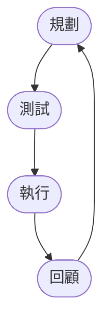
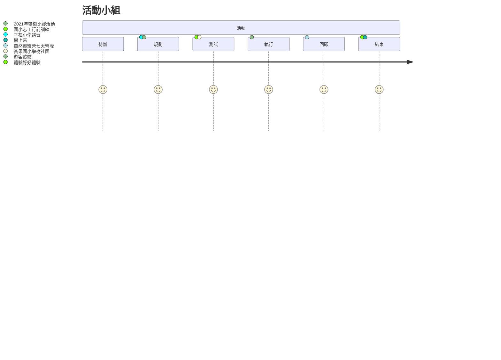
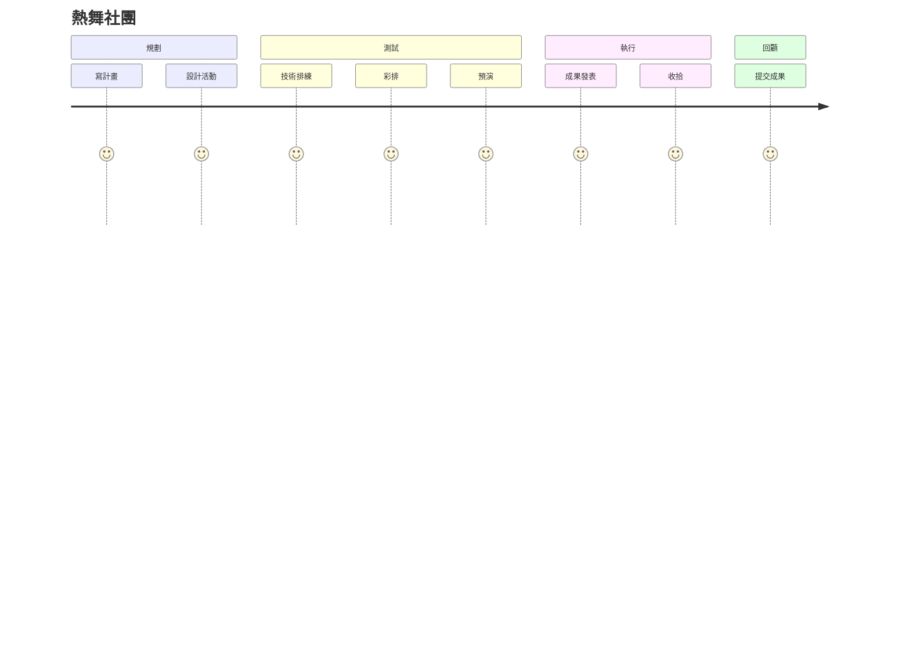

## 簡介
〈規劃與執行〉是將攀樹技術以及跨領域部份結合所進一步總結的果實，由於規劃活動與執行所作的事情很類似於軟體開發，而敏捷這樣的概念也很符合活動的規劃與執行上，雖然時間比較長以及不像軟體一樣可以模擬，但相信隨著時間的推移技術與結合方式將帶給這一切不同的作法，秉持這樣的信念將敏捷軟體開發、活動規劃、活動執行以及專案管理的結合與實踐方式的 Know-how 寫下。

## 敏捷活動規劃宣言
「敏捷活動規劃宣言」(Manifesto for Agile Event Planning)是一個將[「敏捷軟體開發宣言」(Manifesto for Agile Software Development)](https://agilemanifesto.org/iso/zhcht/manifesto.html)應用在活動規劃與執行上，並且因為活動規劃與軟體開發有相似之處，除了轉換基本語句也會加上活動規劃上必須要有的內容。

### 核心
藉著親自並協助他人進行朝著「本然」前進，我們正致力於發掘更優良的教育內容。透過這樣的努力，我們已建立以下價值觀:  

- **個人與互動** 重於 流程與工具  
- **可用的活動** 重於 詳盡的文件  
- **與客戶合作** 重於 合約協商  
- **回應變化** 重於 遵循計劃  

也就是說，雖然右側項目有其價值，但我們更重視左側項目。  

### 敏捷宣言背後的原則
敏捷宣言背後的原則，我們遵守敏捷活動的13個原則:  

- 透過實際的工具、實作與文化實踐活動規劃與執行的安全。
- 我們最優先的任務，是透過及早並持續地交付有價值的活動計畫來滿足客戶需求。
- 竭誠歡迎改變需求，甚至已處計畫後期亦然。敏捷流程掌控變更，以維護客戶的競爭優勢。
- 經常交付可用的計畫，頻率可以從數週到數個月，以較短時間間隔為佳。
- 業務人員與規劃者必須在專案全程中天天一起工作。
- 以積極的個人來建構專案，給予他們所需的環境與支援，並信任他們可以完成工作。
- 面對面的溝通是傳遞資訊給開發團隊及團隊成員之間效率最高且效果最佳的方法。
- 可用與良好的規劃並成功執行是最主要的進度量測方法。
- 敏捷程序提倡可持續的規劃。贊助者、開發者及使用者應當能不斷地維持穩定的步調。
- 持續追求優越的技術與優良的設計，以強化敏捷性。
- 精簡──或最大化未完成工作量之技藝──是不可或缺的。
- 最佳的架構、需求與設計皆來自於能自我組織的團隊。
- 團隊定期自省如何更有效率，並據之適當地調整與修正自己的行為。

### 目標
簡單來說達到「敏捷活動規劃宣言」如下:

- 積極與樂於改變的態度，以客戶的利益為出發點，盡力做出可用與良好的規劃並成功執行。
- 天天面對面與人互動，重視團隊成功重於個人成功。
- 持續且短時間交付計畫，並能持續追求優越技術與優良設計。
- 定期自我反省並實際做出改善。

## 活動週期與流程
活動規劃與週期分成四個流程，分別是規劃、測試、執行、回顧，形成一個持續的循環，每一次的循環。

另外這個循環不是指這個團隊或者人一次在這個循環結束前不能進行其他循環，或者限制循環開始時只能執行一個團隊，甚至限制一個時間，他是一個工作流程與狀態，是可以依照時間規劃去分配的。

當然也可以用在藝術性質的表演上，可能會是大家比較熟悉的。

### 規劃

### 測試

### 執行

### 回顧

## 工具使用
### GitLab
### Jira Work Management
## 圖表分析
以下是常見的圖表分析。

### 燃盡圖
#### 知識

燃盡圖是Scrum中基本的分析圖表，也是燃燒圖的一種，因為會像火一樣將東西越燒越小，所以叫燃盡圖。基本的燃盡圖有幾個知識要知道：

1. 議題類型：可以看到Y軸名稱知道該圖表所採用的議題類型為何，基本上X軸就是時間，此圖單位為時間。
1. 「基準線」(Guideline)：基準線，也稱預估線，也就是將開始處議題數量最高處畫一條直線到結束那天且議題數為0處，其實就是在算面積，是將「議題乘上實際工作天數除以二」 $` \frac {Issue \ number \times Working Days} {2}`$ 得到。
1. 「剩餘值」(Remaining Values)：衝刺中實際完成議題的數量，每完成一個議題將總數值減一，並將對應的時間上畫一點。

另外有可能會有其他資訊，如這張圖有：

- 「衝刺」(Sprint)：衝刺時間，1~4週的時間。
- 「未工作天」(Non-Working Days)：例如假日，這時會變成平的結束時等比例往下走。

以此圖為例可以得到初步的資訊：

- 衝刺：時間從12月12日 ~ 1月2日，經過三週的時間共十五天。
- 基準線：45個Story類型議題，因此基準線計算公式後得。
- 剩餘值：最開始的議題數量為45個Story類型議題。

#### 指標
閱讀燃盡圖四個現象：

- 進度超前
- 進度穩定
- 進度落後
- 進度停擺

觀察重點為 **議題消耗的數量所繪製出來線比對基準線時的狀況為何？**

#### 分析
由於相關知識中示範圖中沒有超前範例，因此另外提供新的範例。下圖為 **進度超前** 的狀況。當消耗值產生的線大多都低於基準線時，代表整體團隊進度是進步的。

進度穩定時消耗線會在基準線的周遭與附近，例如下圖紅色框起來為 **進度穩定** 的狀況。

進度落時消耗線會高於與遠離基準線，越嚴重遠離且高於基準線。例如下圖紅色框起來為 **進度落後** 的狀況。

進度落後時消耗線會高且遠離基準線，且進度線會是平的連續好幾天，代表這段時間議題都是尚未完成的。雖然在接近衝刺結束時有大幅往前但仍然比未再這次衝刺中完成進度。例如下圖紅色框起來為 **進度落後** 且 **進度停滯** 的狀況。

對應作法：

- 進度超前時：先思考是不是團隊進步了？是不是議題分配的過少？任務相對預計簡單？需求並未是客戶所想要的所以提早關閉？
- 進度穩定時：代表團隊是穩定運作，如果團隊的連續好幾個週期進度都穩定，那這樣代表團隊的產出是可以估計的，這是件好事。同時團隊也可以嘗試讓自己進步來加速速度。
- 進度落後：正常的進度落後是正常的，可以稍加注意依照狀況干涉，檢討時看是不是任務給定過多？還是任務較預期的難？可於衝刺結束後進行討論與回顧，改善下次衝刺過程。
- 進度停滯時：當進度停滯時且連續超過好幾天甚至一週時，該要好好注意一下並關心開發團隊，尋找是什麼原因？是不是任務給太多？是不是要拆解？是不是要留給下次衝刺？是不是有什麼困難的原因？還是誰請假了所以分配的任務一直沒有完成？

最重要的，要依照實際關閉的議題與圖表做對應與分析，了解這時候為何會這樣，這樣才可以知道真正的情況為何。

### 燃起圖
#### 知識

燃起圖算是燃盡圖的變形，也是燃燒圖的一種，因為會像火一樣越來越旺，所以叫做燃起。以下有幾個知識要知道：

1. 議題類型：可以看到Y軸名稱知道該圖表所採用的議題類型為何，基本上X軸就是時間，此圖X軸可能為天。
1. 「基準線」(Guideline)：基準線，也稱預估線，也就是將開始處議題數量最低處畫一條直線到結束那天工作範圍實際高度。其實就是在算面積，是將「議題乘上實際工作天數除以二」 $` \frac {Issue \ number \times Working Days} {2}`$ 得到。值得注意的是燃起圖的特性，基準線會隨著工作範圍的改變而有增斜與減緩的狀況，直到衝刺結束當天才是基準線的最終結果。
1. 「完成的工作」(Completed Work)：衝刺中實際完成議題的數量，每完成一個議題將總數值加一，並將對應的時間上畫一點。
1. 「工作數量範圍」(Work scope)：此次衝刺中衝刺待辦事項的Issue數量。

另外有可能會有其他資訊，如這張圖有：

- 「衝刺」(Sprint)：衝刺時間，1~4週的時間。
- 「未工作天」(Non-Working Days)：例如假日，這時會變成平的結束時等比例往下走。

以此圖為例可以得到初步的資訊：

- 衝刺：時間從7月1日 ~ 7月13日，經過兩週的時間共14天。
- 基準線：45個Story類型議題，因此基準線計算公式後得。
- 剩餘值：最開始的議題數量為45個Story類型議題。

#### 指標
閱讀燃起圖五個現象：

- 進度超前
- 進度穩定
- 進度落後
- 進度停擺
- 衝刺待辦事項變動

觀察重點為：

- **議題完成的數量所繪製出來線比對基準線時的狀況為何？**
- **在衝刺中是否有新的任務從衝刺待辦事項中增減？**

#### 分析
由於相關知識中示範圖中沒有超前範例，因此另外提供新的範例。

下圖紅色框起來為 **進度超前** 的狀況。當消耗值產生的線大多都低於基準線時，代表整體團隊進度是進步的。

進度穩定時消耗線會在基準線的周遭與附近，例如下圖紅色框起來為 **進度穩定** 的狀況。

進度落時完成線會持續低於與遠離基準線，越嚴重越遠離且越低於基準線。例如下圖為 **進度落後** 的狀況。

進度落後甚至到停滯時完成線會低於且持平地遠離基準線，代表這段時間議題都是尚未完成的。下圖為 **進度停滯** 的狀況。

接下來來探討關於衝刺中衝刺待辦事項的變動情形，下面這張圖值得注意的是待辦事項中有變動的狀況，在11/4之後議題數量的增加。

對應作法：

- 進度超前時：先思考是不是團隊進步了？是不是議題分配的過少？任務相對預計簡單？需求並未是客戶所想要的所以提早關閉？
- 進度穩定時：代表團隊是穩定運作，如果團隊的連續好幾個週期進度都穩定，那這樣代表團隊的產出是可以估計的，這是件好事。同時團隊也可以嘗試讓自己進步來加速速度。
- 進度落後：正常的進度落後是正常的，可以稍加注意但還不需要直接干涉，可於衝刺結束後進行討論與回顧，改善下次衝刺過程。
- 進度停滯時：當進度停滯時且連續超過好幾天甚至一週時，該要好好注意一下並關心開發團隊，尋找是什麼原因？是不是要拆解？是不是要留給下次衝刺？是不是有什麼困難的原因？還是誰請假了所以分配的任務一直沒有完成？
- 衝刺待辦事項變動：可以觀察到衝刺待辦清單的變動，這個是燃盡圖所沒辦法看到的。如果工作範圍變動了，代表衝刺中工作量的增減，所延伸的可能是需求或者市場的變動造成了增減；也功能往後延後開發；也有可能是急單的狀況發生。

最重要的，要依照實際關閉的議題與圖表做對應與分析，了解這時候為何會這樣，這樣才可以知道真正的情況為何。

### 累積流圖
#### 相關知識

這是一個給使用Kanban主要使用的流程看板，同樣用於觀察任務的完成狀況，與燃盡圖或燃起圖所不同的是，因為沒有時間的限制以及Kanban連續流動性，所以觀察方式主要採用觀察累加的情況來作為任務判斷的依據。以下有幾個知識要知道：

1. 議題類型：可以看到Y軸名稱知道該圖表所採用的議題類型為何，基本上X軸就是時間，此圖X軸可能為天。
1. 累加情形：每一筆數據代表的是議題在流程看板中所到的階段，當有議題移往某一個階段時，原本階段紀錄的不改變，進入到新的階段會在該階段加1。
1. 工作流程：由於持續的累加，因此在正常情況下會依照工作流程的順序，流程愈後面所呈現的累加值一定筆前一個高。

另外有可能會有其他資訊，如這張圖需要觀察的有三筆數據，流程順序為：

1. 「準備去做」(To Do)
1. 「正在進行」(In Progress)
1. 「完成」(Done)

以此圖為例可以得到初步的資訊：

- 知道不同的階段所有數量與狀況

#### 指標
閱讀累積流圖四個現象：

- 產能過高
- 產能穩定
- 產能過第
- 產能停擺

觀察重點為：

- **觀察散射與收緊的情況，每筆數據之間的間距**

#### 分析
由於相關知識中示範圖中沒有超前範例，因此另外提供新的範例。

當產能過高時，所有工作流程線會往上縮緊。下圖為 **產能過高** 的狀況。

產能穩定時所有不同狀態的線與線之間會呈現平均的寬度，例如下圖為 **產能穩定** 的狀況。

產能落後時工作線會呈現擴大的狀況，越嚴重擴張的越大。例如下圖為 **產能落後** 的狀況。

產能落後甚至到停滯時，這段時間流程的下一階段是不會有所增長的，而維持水平。下圖紅色框起為 **產能停滯** 的狀況。

而對應的作法所要做到的基本想法就是 **設法讓曲線變得平滑** ，對應作法：

- 產能過高時：產能過高不一定都是好事，而是要看工作流程中下一階段是否會被影響，有時完成速度過快，但下一階段例如Testing、Build等卡關了，WIP累積過多，這樣就造成反效果了。先思考是團隊進步了？會造成其他流程卡住嗎？造成卡住時是不是該減少投入的資源？
- 產能穩定時：代表團隊是穩定運作，如果團隊的連續好幾個週期產能都穩定，那這樣代表團隊的產出是可以估計的，這是件好事。同時團隊也可以嘗試讓自己進步來加速速度。
- 產能落後：若非待辦事項代表有流程中有卡關的地方要疏通讓她變得流暢或改進。如果是 To Do 等這類待辦事項增長幅度過高，則可能需求放入的過於多且高，該注意會不會答應了過多的進度。
- 產能停滯時：當停滯時且連續超過好幾天甚至一週時，該要好好注意一下並關心開發團隊，尋找是什麼原因？是不是要拆解？是不是要留給下次衝刺？是不是有什麼困難的原因？還是誰請假了所以分配的任務一直沒有完成？

最重要的，要依照實際關閉的議題與圖表做對應與分析，了解這時候為何會這樣，這樣才可以知道真正的情況為何。

### 結論

- 實際狀況不只有這次討論的內容，但上述為基本的分析方法
- 都用適於敏捷開發，而且三種看板除了不斷追求進步，還要追求穩定且可以估計的進步
- Brundown Chart、Brunup Chart要關注的是時間內完成能力， Cumulative Flow Diagram 是每完成一個任務所需要的時間
- 三種圖表都可以用在 Scrum 、 Kanban 模式內
- 無法直接透過圖表得知原因，但可以知道目前團隊狀況

## 活動示範

## 結論
